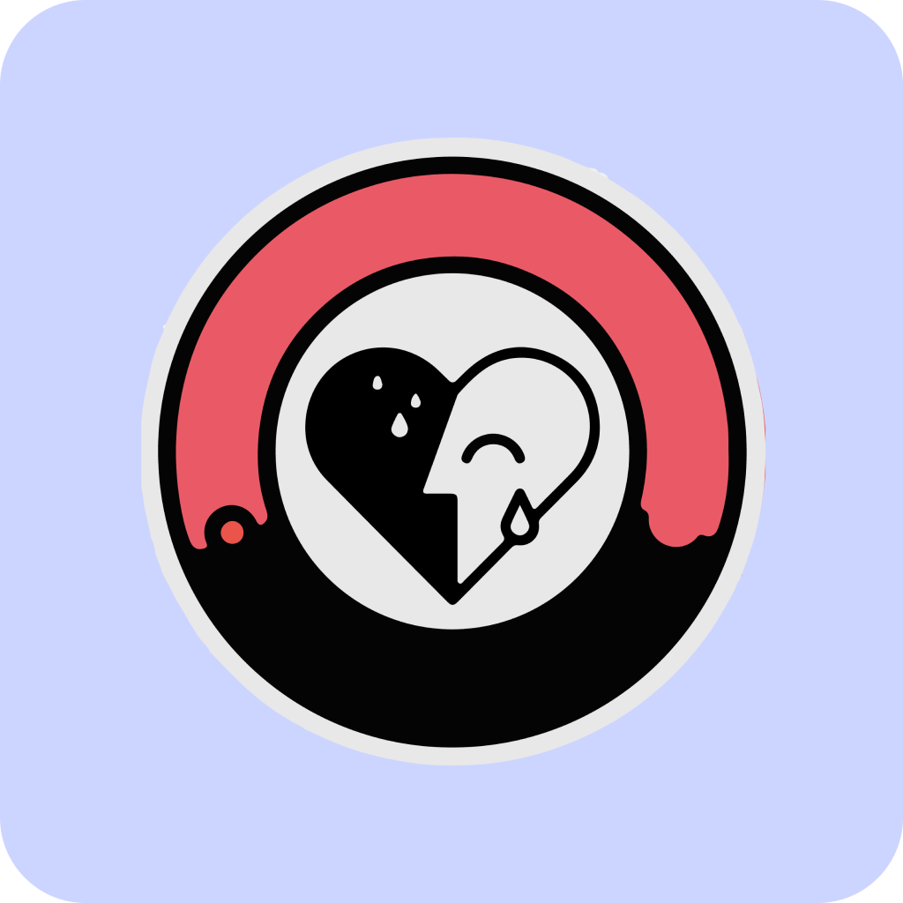

<!-- PROJECT LOGO -->
<br />


<h6 align="center">Pieter Venter IOS Expanded 304</h6>
<p align="center">
</br>
   
  <a href="https://github.com/Pieter-stack/UniHealth">
    
  </a>
  
  <h3 align="center">Uni Health</h3>

  <p align="center">
This app is for university students to help them stay healthy throughout sterssful terms and also keep track of their helath and summarize the findings for quick and easy access at your fingertips.
<br>
      <a href="https://github.com/Pieter-stack/UniHealth"><strong>Explore the docs »</strong></a>
      <br />
      <br />
      <a href="add video">View Demo</a>
       ·
       <a href="https://github.com/Pieter-stack/UniHealth/issues">Report Bug</a>
       ·
       <a href="https://github.com/Pieter-stack/UniHealth/issues">Request Feature</a>
   </p>

<!-- TABLE OF CONTENTS -->
## Table of Contents

* [About the Project](#about-the-project)
  * [Project Description](#project-description)
  * [Built with](#built-with)
* [Getting Started](#getting-started)
  * [Prerequisites](#prerequisites)
  * [Installation](#installation)
* [Features and Functionality](#features-and-functionality)
   * [Features](#features)
   * [Functionality](#functionality)
* [Concept Process](#concept-process)
   * [Ideation](#ideation)
   * [Wireframes](#wireframes)
   * [User-flow](#user-flow)
* [Development Process](#development-process)
   * [Implementation Process](#implementation-process)
        * [Highlights](#highlights)
        * [Challenges](#challenges)
   * [Reviews and Testing](#reviews-and-testing)
   * [Future Implementation](#future-implementation)
* [Final Outcome](#final-outcome)
   * [Mockups](#mockups)
   * [Promotional Video](#promotional-video)
* [Roadmap](#roadmap)
* [Contributing](#contributing)
* [License](#license)
* [Contact](#contact)
* [Acknowledgements](#acknowledgements)

<!--PROJECT DESCRIPTION-->
## About the Project

![image1][image1]

### Project Description
This app is designed and developed for university students when they are struggling to stay healthy, throughout each stressful term.

The app features a simple onboarding process to showcase the key points to stay healthy as a student, while still being able to get through a term. The app has faceId and fingerprint security to only allow the owner of the data to view it, making it even more secure and easy system for the students.

Being able to view 5 major health tracking features like, calories burned, walking/running distance for when you are late for class , Uni Health keeps track of everything that will help students stay healthy , telling the sitting and standing time of a student helps them see that they need to take breaks from the computer and walk around.

UniHealth tracks weekly progress and with the widget right on the homescreen the user can quickly view their stats to not waste time with their busy schedules.

### Built With

* [xcode](https://developer.apple.com/xcode/)
* [SwiftUI](https://developer.apple.com/xcode/swiftui/)
* [GitHub](https://github.com/)

&nbsp;&nbsp;&nbsp;&nbsp;&nbsp;&nbsp;&nbsp;&nbsp;
&nbsp;&nbsp;&nbsp;&nbsp;&nbsp;&nbsp;&nbsp;&nbsp;
&nbsp;&nbsp;&nbsp;&nbsp;&nbsp;&nbsp;&nbsp;&nbsp;

<!-- GETTING STARTED -->
## Getting Started

These instructions will get you a copy of the project up and running on your local machine for development and testing purposes.

### Prerequisites

For development, the latest version of Visual Studio is required. The latest version can be downloaded from [Xcode](https://developer.apple.com/xcode/)

### Installation
 
1. Clone the repo
```sh
git clone https://github.com/Pieter-stack/UniHealth.git
```
2. Open the project

  Locate and drag file into xcode.

3. Run project

```sh
Choose simulator and press play button in top left corner
```

<!-- FEATURES AND FUNCTIONALITY-->
## Features and Functionality

### Features

### Splash screen.

![image10][image10]

See the splash screen when you open up the app

### Onboarding. 

![image2][image2]

Onboarding experience for the user to learn more about the app

### Authentication.

![image4][image4]

Fingerprint and FaceId to log the user into the app and keep their data safe

### Dashboard.

![image3][image3]

See 5 categories of health tracking data right at your fingertips

### Detailed health progress.

![image6][image6]

Track your health data for the last 7 days

### Help keep you healthy.

![image5][image5]

Help you stay healthy in stressful terms


### Artwork and designs created by me

The artwork was created with Figma.

### Functionality

* `HealthKit` is used to track the users health stats within the app.
* `5 Categories` to track your stats.
* `Track` the last 7 days of your health and get detailed statistics.
* `Authenticate` ythrough fingerptint and faceId.
* `Onbaording` to help the user learn more.

<!-- CONCEPT PROCESS -->
## Concept Process

The `Conceptual Process` is the set of actions, activities and research that was done when starting this project.

### Ideation

![image7][image7]

### Wireframes

![image8][image8]

### User-flow

![image9][image9]

<!-- DEVELOPMENT PROCESS -->
## Development Process

The `Development Process` is the technical implementations and functionality done in the backend of the application.

### Implementation Process

#### Design Architecture
`SwiftUI` to design the pages used in UniHealth.

#### Highlights

* One highlight was to `explore` being a student and make an app to help me track my health stats.
* `HealthKit` was simple and esay to implement and there are so much more to be explored.
* I loved creating new interfaces where I created a `widget` for this project.

#### Challenges

* I struggled with implementing HealthKit into the widget.

### Reviews and Testing
The `Reviews and Testing` consists of `in class`, reviews.

#### Future Implementation

* Add `More` health stats for the user.
* Have the user select and deselect the health stats he/she wants to track.
* Improve the `widget`.

<!-- MOCKUPS -->
## Final Outcome

### Mockups

![image11][image11]

<!-- PROMO VIDEO -->
## Promotional Video

To see the promotional video, click below:

[View Promotional Video](add video)

<!-- ROADMAP -->
## Roadmap

See the [open issues](https://github.com/Pieter-stack/UniHealth/issues) for a list of proposed features (and known issues).

<!-- CONTRIBUTING -->
## Contributing

Contributions are what make the open source community such an amazing place to be learn, inspire, and create. Any contributions you make are **greatly appreciated**.

1. Fork the Project
2. Create your Feature Branch (`git checkout -b feature/AmazingFeature`)
3. Commit your Changes (`git commit -m 'Add some AmazingFeature'`)
4. Push to the Branch (`git push origin feature/AmazingFeature`)
5. Open a Pull Request

<!-- AUTHORS -->
## Authors

* **Pieter Venter** - [PieterVenter](https://github.com/Pieter-stack)

<!-- LICENSE -->
## License

Distributed under the MIT License. See `LICENSE` for more information.\

<!-- LICENSE -->
## Contact

* **Pieter Venter**  - pieterven12@gmail.com
* **Project Link** - https://github.com/Pieter-stack/UniHealth

<!-- ACKNOWLEDGEMENTS -->
## Acknowledgements

* [Mockups](https://www.freepik.com)
* [Lecturer](https://github.com/ArmandPret)


<!-- MARKDOWN LINKS & IMAGES -->
[image1]: Images/Image1.png
[image2]: Images/Image2.png
[image3]: Images/Image3.png
[image4]: Images/Image4.png
[image5]: Images/Image5.png
[image6]: Images/Image6.png
[image7]: Images/Image7.png
[image8]: Images/Image8.png
[image9]: Images/Image9.png
[image10]: Images/Image10.png
[image11]: Images/Image11.png
